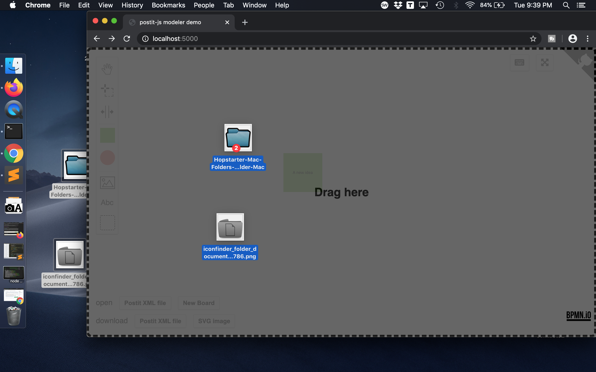
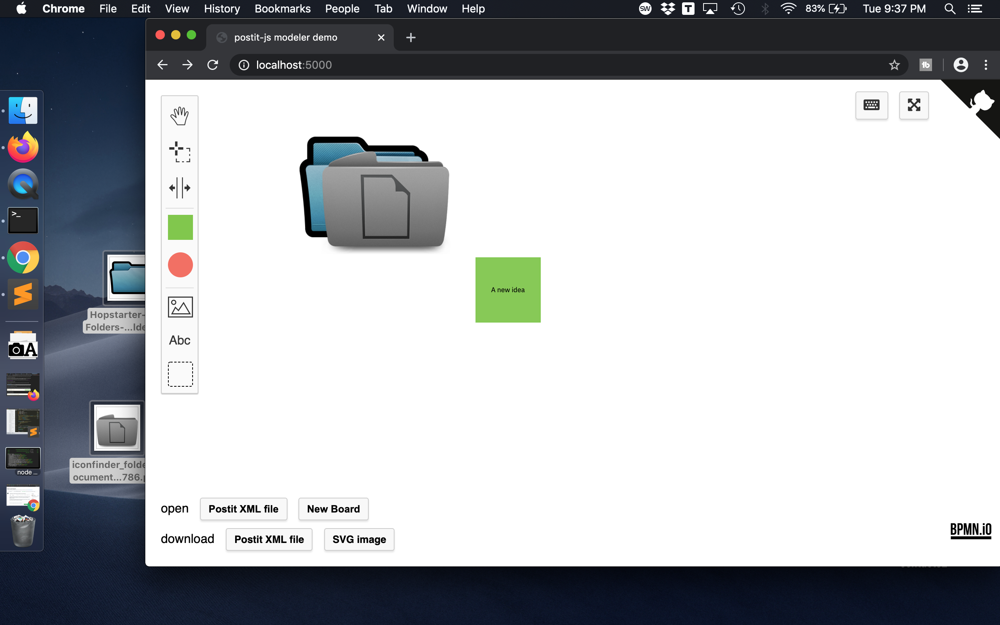
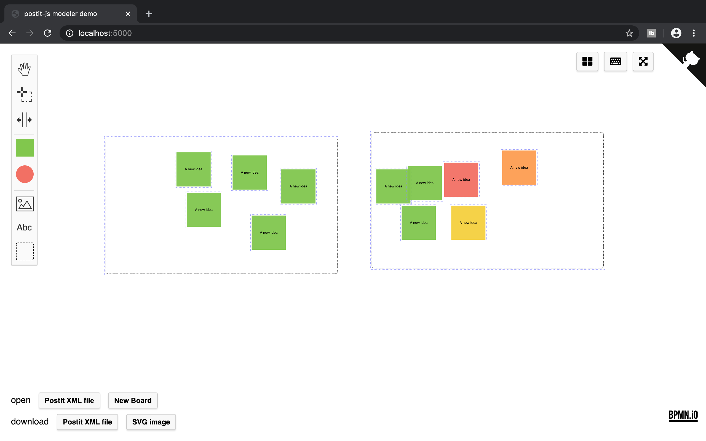
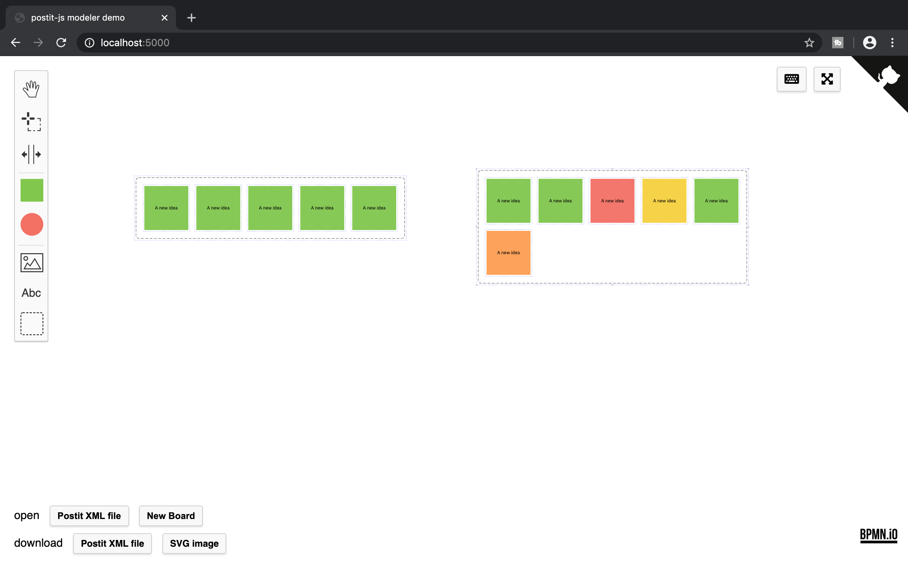
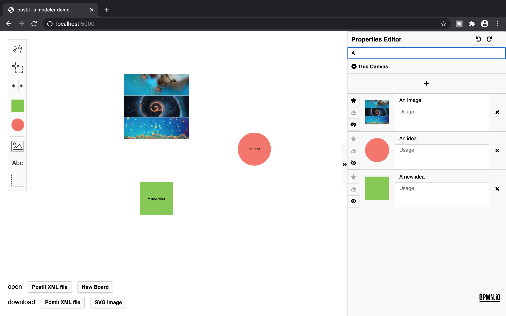

# postit-js-extensions
A collection of extensions for [**diagram-js**](https://github.com/bpmn-io/diagram-js) based projects such as [**postit-js**](https://github.com/pinussilvestrus/postit-js).

## Installation

### dependencies
- The extension **properties-panel** is dependent on functions in **postit-js** and the npm packages less, immutable, lodash

### npm install
You can install the project via npm directly from git:

```sh
npm install --save https://github.com/xanpj/postit-js-extensions
```

Then in your main loader choose the modules to import from the extensions.

```javascript
import PostItExtensions from 'postit-js-extensions';
...
var modeler = new DiagramJsModeler({
    ...
    additionalModules: [
       ...
       PostItExtensions.DragDropImages,
       PostItExtensions.SelectionOrganizer,
     ]
 });
```

### Manual install
Drag the folders of your chosen modules from this `lib/features/` directory into your project's `lib/features/` folder.
Your project needs to be a [**diagram-js**](https://github.com/bpmn-io/diagram-js) based projects i.e. [**bpmn-js**](https://github.com/bpmn-io/bpmn-js), [**postit-js**](https://github.com/pinussilvestrus/postit-js) etc.

Import the modules in your modeler.js (or the place where you add your modules)

```javascript
import SelectionOrganizerModule from './features/selection-organizer';
import DragDropImagesModule from './features/drag-drop-images';
```
and add them as additionalModules (or  `_modelingModules` in postit-js)

```javascript
Modeler.prototype._modelingModules = [
  ...
  SelectionOrganizerModule,
  DragDropImagesModule
];
```

## Modules
### Drag-Drop-Images




### Selection-Organizer




### Properties-Panel

